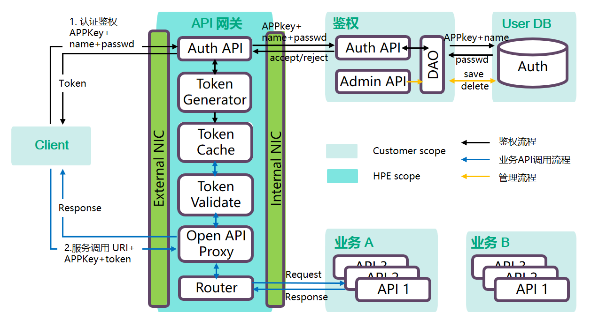

## 1. 项目说明
此项目用于演示：

- HPE API 网关的用法；
- 外部客户端对接 API 网关的参考实现；
- 鉴权模块的参考实现；
- 业务模块的参考实现；

## 2. 项目内容
- auth: Auth（鉴权模块）参考实现；
- client: Client 参考实现；
- client-web: 基于 HTML 的 client 参考实现；
- hello: 一个简单的业务 API demo；
- hpe-gateway: 测试用的 mock 网关；
- eureka-server: 注册服务器；

项目基于 Spring Boot 和 Spring Cloud，可在 Linux 或 Window 下编译运行。

## 3. 架构


HPE 提供：

- API 网关，功能：
    + 生成 token；
    + 校验 token；
    + 将 request 路由到 业务API；

客户提供：

- Client（客户端）；
- Auth（鉴权模块）；
- 业务APP；

## 4. Auth（鉴权模块）和网关模块 API 说明
https://github.com/hpe-microservice/api-gateway-demo/blob/master/doc/API.md

## 5. How to run

### 1) 运行服务器
1. **下载代码**：
``` shell
$ git clone git@github.com:hpe-microservice/api-gateway-demo.git
```
2. **修改数据库 url、username、password**（*src/auth/src/main/resources/application.yml*）：
``` shell
$ cd api-gateway-demo/src
$ cat auth/src/main/resources/application.yml
spring:
  datasource:
    type: org.apache.tomcat.jdbc.pool.DataSource
    driverClassName: com.mysql.jdbc.Driver
    url: jdbc:mysql://192.168.10.128:3306/zjmcc_db?useUnicode=true&characterEncoding=UTF-8
    username: zjmcc
    password: password
  jpa:
    show-sql: true
    hibernate:
      ddl-auto: update
    properties:
      hibernate:
        dialect: org.hibernate.dialect.MySQL5Dialect
```
3. **构建工程**：
``` shell
$ cd api-gateway-demo/src
$ mvn clean package -DskipTests=true
```
4. **运行服务器**：auth + hello + eureka-server + hpe-gateway
``` shell
$ cd api-gateway-demo/src
$ ./run.sh
```

**Note**:

- 所有服务器 log 保存在目录 *api-gateway-demo/src/log*；
- auth 工程启动后，**会自动在 MySQL 数据库中创建 auth 表**（如 auth 表不存在）；

### 2) 运行 JAVA client
``` shell
# appkey=1007 username=Mike password=abcd apiURL=http://localhost:8080/hello
$ cd api-gateway-demo/src
$ java -jar client/target/client.jar 1007 Mike abcd http://localhost:8080/hello
```

JAVA client 先尝试从网关获取 token， 成功后通过网关访问网关后面的 hello 微服务，并打印微服务返回的结果（返回 “**你好，POC！**”）。

### 3) 运行 WEB client
- 直接用浏览器（Firefox）打开 src/client-web/login.html；
- 填入 appkey、username、password，点击 `Login` 按钮登陆并获取 token；
- 成功获取 token 后，点击 `Call API` 按钮调用 API；
- 对话框弹出 “**你好，POC！**” 说明调用成功；


**程序端口**:

- auth：8090
- hello：8091
- open-gateway：8080
- eureka-server：8761

## 6. How to stop
Window 下通过 **命令管理器** 结束 JVM 进程。

Linux 下通过 `kill -9 <pid>` 结束 JVM 进程。
